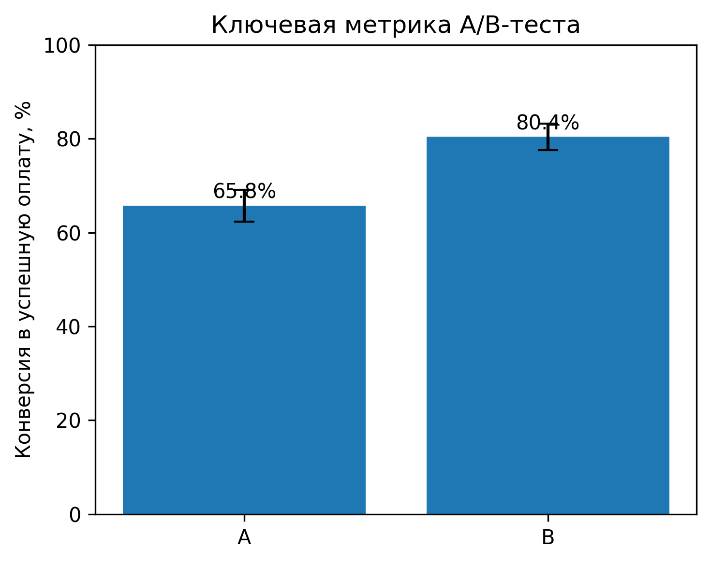
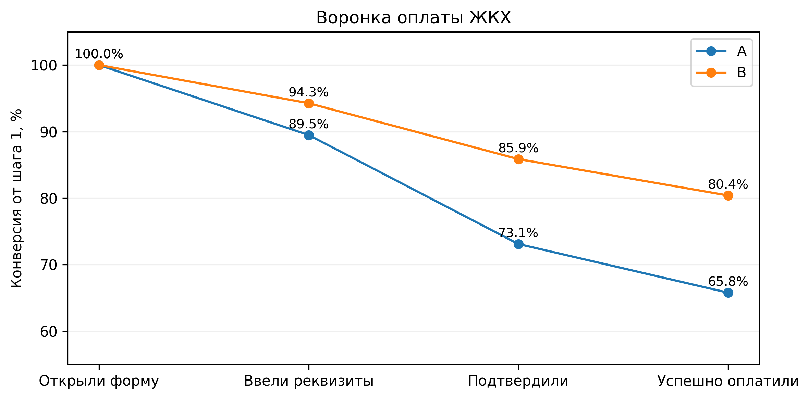

# A/B-тест новой формы оплаты ЖКХ

**Итог: новая форма повышает конверсию в успешную оплату с 65,78% до 80,40% (+14,62 п.п., 95% ДИ: +10,20…+19,05 п.п., p < 0,001). Это ≈ 146 дополнительных оплативших на каждую 1000 пользователей, открывших форму. Рекомендую раскатывать.**



## Задача

Продуктовая команда сделала новую форму оплаты ЖКХ и запустила A/B-тест: группа A видит старую форму, группа B — новую. Нужно понять, лучше ли новая форма доводит пользователей от открытия формы до успешной оплаты.

**Гипотеза:** новая форма проще, поэтому больше пользователей доходят до успешной оплаты.

## Данные

> **Данные синтетические.** Цифры в них не совпадают с результатами в ноутбуке, но структура данных и паттерны поведения пользователей те же.

Файл `dannie_T.xlsx`, период теста — апрель 2024, два листа:

| Лист | Строк | Поля |
|---|---|---|
| «Пользователи» | ~1 500 | `user_id`, `group` (A/B), `age`, `city`, `device_type` |
| «Платежи» | ~2 600 | `payment_id`, `user_id`, `group` и время каждого шага: `step1_opened` → `step2_entered` → `step3_confirmed` → `step4_success` |

Одна строка в «Платежах» — одна попытка оплаты. У пользователя может быть несколько попыток. Пустое время шага означает, что пользователь до него не дошёл.

## Проверка и очистка данных

Проверила пропуски, дубли `user_id` и `payment_id`, допустимые значения групп и возраста, совпадение группы в платежах и в таблице пользователей, а также порядок шагов воронки: нет ли попыток, где следующий шаг есть, а предыдущего нет. Нарушений порядка шагов не нашлось.

| Что нашла | Что сделала | Почему |
|---|---|---|
| Пользователь без группы | удалила | нельзя отнести ни к A, ни к B |
| Возраст −5 и 150 | удалила пользователей | явно некорректные записи |
| Платёж без `user_id` | удалила | нельзя связать с пользователем и группой |
| Группа в платеже не совпадает с группой пользователя | группу беру из таблицы пользователей | рандомизация была по пользователям |
| Пропуск города | оставила | на основную метрику не влияет |

После очистки: **1 501 пользователь** (A = 751, B = 750) и **2 660 платежей**. Группы почти одинакового размера.

## Методология

- **Основная метрика:** доля пользователей, у которых за период теста была хотя бы одна успешная оплата.
- **Единица анализа — пользователь, а не платёж.** Один человек мог сделать несколько попыток и не должен из-за этого получать в тесте больший вес.
- **Тест:** z-тест для двух долей. Результат для пользователя бинарный (оплатил или нет), группы независимые и достаточно большие для нормальной аппроксимации.
- **Оценка эффекта:** абсолютная и относительная разница конверсий, 95% доверительный интервал разницы.

## Результаты

| | A — старая форма | B — новая форма |
|---|---|---|
| Пользователей | 751 | 750 |
| Успешно оплатили | 494 | 603 |
| Конверсия | 65,78% | 80,40% |

- Абсолютный прирост: **+14,62 п.п.**, относительный uplift: **+22,23%**
- z = 6,386, p < 0,000001
- 95% ДИ разницы: [+10,20; +19,05 п.п.]. Интервал целиком выше нуля: даже при самой осторожной оценке эффект — около +10 п.п.

### Воронка

| Переход | A | B | Разница |
|---|---|---|---|
| Открыли → Ввели реквизиты | 89,48% | 94,27% | +4,79 п.п. |
| Ввели реквизиты → Подтвердили | 81,70% | 91,09% | **+9,39 п.п.** |
| Подтвердили → Оплатили | 89,98% | 93,63% | +3,65 п.п. |
| **Итого: Открыли → Оплатили** | **65,78%** | **80,40%** | **+14,62 п.п.** |

Группа B лучше на каждом переходе. Сильнее всего вырос переход «Ввели реквизиты → Подтвердили»: именно здесь старая форма теряла больше всего пользователей. Вероятно, в новой форме проще или понятнее шаг подтверждения платежа.



## Рекомендация

**Раскатывать новую форму (B).** Рост конверсии статистически значимый, большой по величине и виден на всех этапах воронки.

**Ограничения и что проверить дальше:**
- **guardrail-метрики:** время до оплаты, число попыток на пользователя, повторные списания, чтобы убедиться, что рост конверсии не сопровождается ухудшением опыта;
- **устойчивость эффекта** по сегментам (устройство, город, возраст) и по неделям теста;
- **эффект новизны:** тест шёл месяц, после раскатки стоит следить за метрикой;
- **причина улучшения:** что именно в новой форме помогло на шаге подтверждения. Это подскажет следующие гипотезы.

## Структура

```
├── ab_test_utilities.ipynb   # анализ
├── dannie_T.xlsx             # синтетические данные
└── images/                   # графики
```

## Как запустить

```bash
pip install pandas numpy matplotlib statsmodels openpyxl jupyter
jupyter notebook ab_test_utilities.ipynb
```

**Стек:** Python, pandas, NumPy, Matplotlib, statsmodels, Jupyter.
